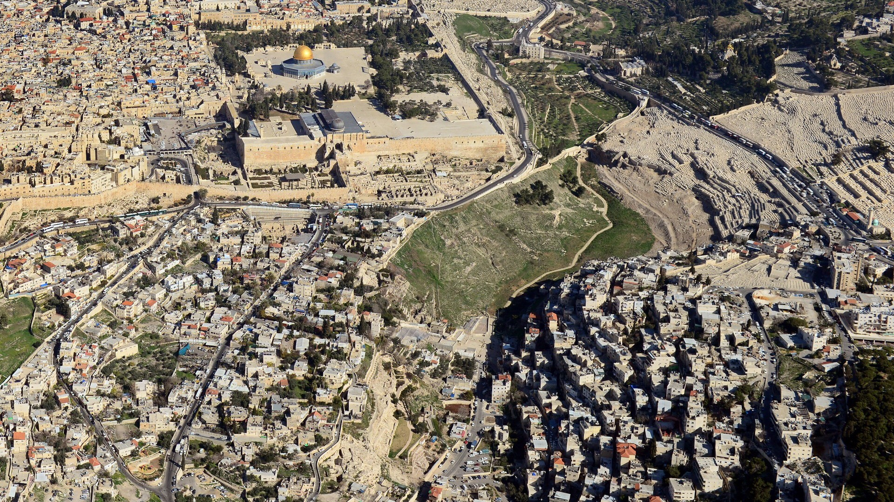

# Coffee Table Book Screensavers

A Roku screensaver framework that turns your TV into a 4K coffee table book. Each theme is a separate screensaver menu entry: full-screen landscape photography with Apple TV Aerial-style captions.



---

## How it works

The **framework** (BrightScript + SceneGraph) is shared across all themes. A **theme** is just a folder of images, a config file, and a manifest. The build script merges them into a Roku-sideloadable ZIP.

```
screensaver/
├── framework/          # Shared Roku channel code (never edit per theme)
│   ├── source/         # main.brs — app entry point
│   └── components/     # Screensaver.xml + Screensaver.brs
├── themes/
│   ├── sample/         # Template for new themes
│   └── israel-natural-beauty/
│       ├── manifest    # Roku channel manifest (registers screensaver name)
│       ├── config/
│       │   └── theme.json   # Image list + captions + timing
│       └── images/          # 4K JPEGs + splash/icon assets
├── scripts/
│   ├── download-theme.sh         # Downloads images from a sourcing manifest
│   └── source-theme-prompt.md    # AI prompt for sourcing new theme images
├── build.sh            # Assembles framework + theme into dist/<theme>.zip
└── Makefile            # make build / make deploy
```

## Deploying a theme to Roku

### Prerequisites
- Roku device in **developer mode**: Settings → System → Advanced system settings → Developer mode
- Note the device IP address and developer password

### Build and sideload

```bash
make build THEME=israel-natural-beauty
make deploy THEME=israel-natural-beauty ROKU_IP=192.168.1.x ROKU_PASS=yourpassword
```

The screensaver will appear in **Settings → Screensaver** on your Roku.

---

## Creating a new theme

### 1. Source images with AI

Open `scripts/source-theme-prompt.md`, fill in your theme description, and paste it into ChatGPT, Claude, or Gemini. It will output a JSON manifest with 40 verified Wikimedia Commons images plus a branding photo.

Save the output as `<theme-slug>.json` at the project root.

### 2. Download images

```bash
./scripts/download-theme.sh <theme-slug> <theme-slug>.json
```

This script:
- Downloads all 40 slideshow images (3840px thumbnails from Wikimedia)
- Generates Roku branding assets from the `branding.splash` image:
  - `splash_hd.jpg` (1920×1080) — channel loading screen
  - `icon_focus_hd.png` (336×210) — highlighted icon in screensaver menu
  - `icon_side_hd.png` (108×69) — side-list icon
- Writes `themes/<theme>/config/theme.json`
- Scaffolds `themes/<theme>/manifest` from the sample template

### 3. Build and deploy

```bash
make build THEME=<theme-slug>
make deploy THEME=<theme-slug> ROKU_IP=192.168.1.x ROKU_PASS=yourpassword
```

---

## Theme config reference

`themes/<theme>/config/theme.json`:

```json
{
  "displayDuration": 12,
  "transitionDuration": 1.5,
  "shuffle": true,
  "images": [
    { "filename": "001_makhtesh_ramon_aerial.jpg", "caption": "Makhtesh Ramon · Aerial View, Negev" }
  ]
}
```

| Field | Description |
|---|---|
| `displayDuration` | Seconds each image is shown |
| `transitionDuration` | Crossfade duration in seconds |
| `shuffle` | Randomize order on each run |
| `images[].caption` | Displayed lower-left, fades in after 2 s |

---

## Included themes

| Theme | Images | Description |
|---|---|---|
| [Israel: Natural Beauty](themes/israel-natural-beauty/) | 39 | Negev craters, Galilee, Dead Sea, Mediterranean coast |

---

## Platform support

Currently Roku only. The framework is designed for future expansion to Samsung (Tizen) and Apple TV (tvOS).

## Image sources and licensing

All images are sourced from [Wikimedia Commons](https://commons.wikimedia.org/) under open licenses (CC BY, CC BY-SA, or Public Domain). Attribution per image is recorded in each theme's source manifest (e.g., `israel-natural-beauty.json`).
